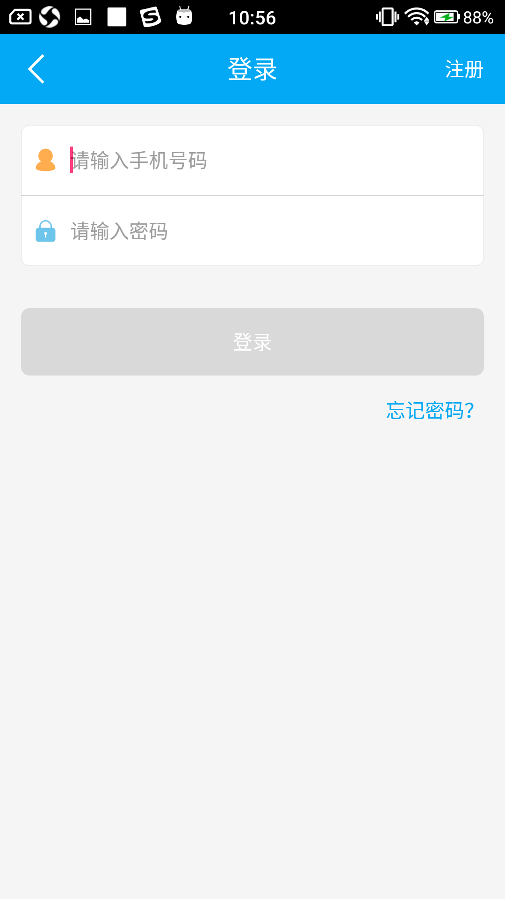
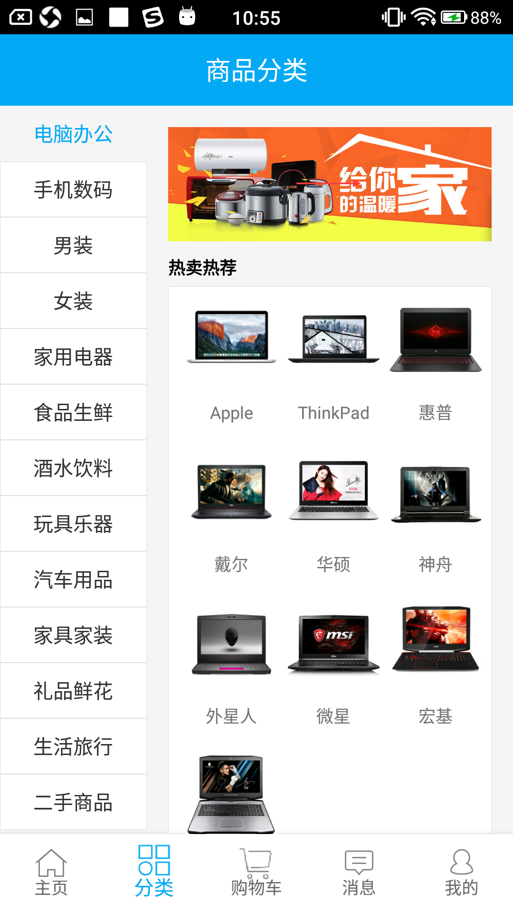
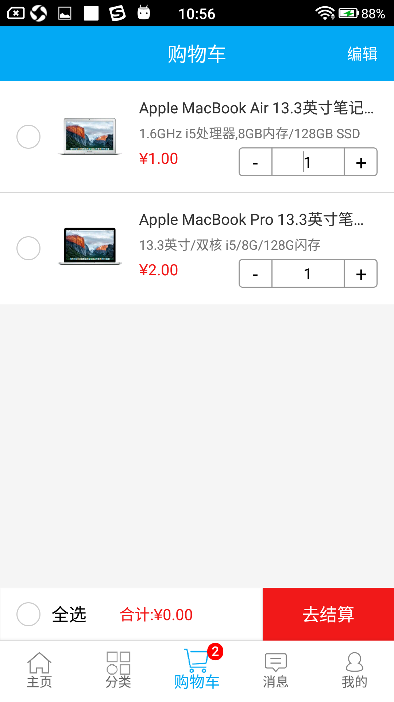
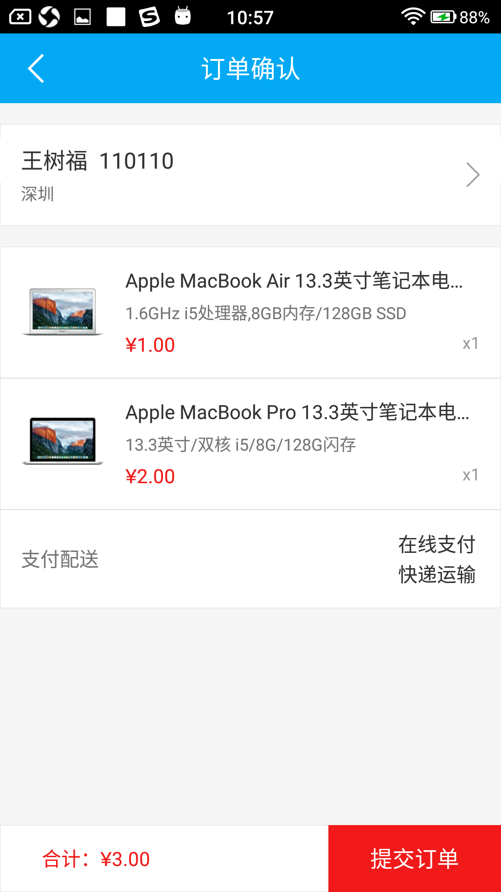
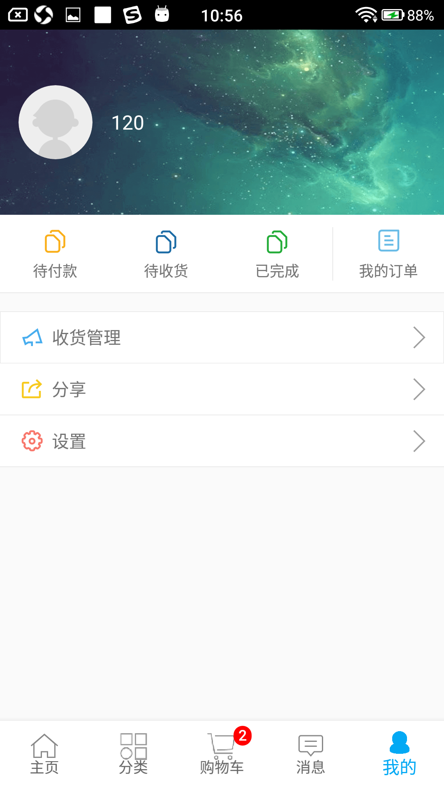
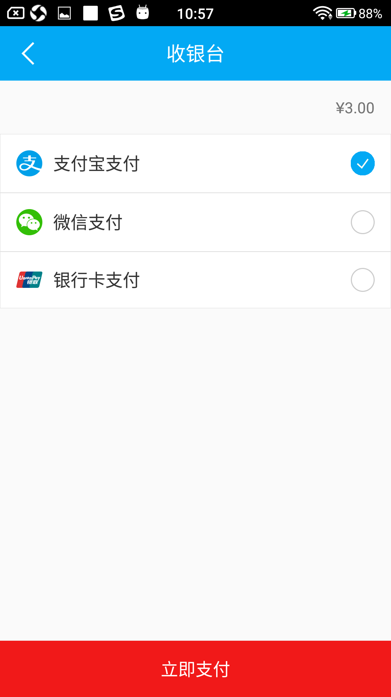
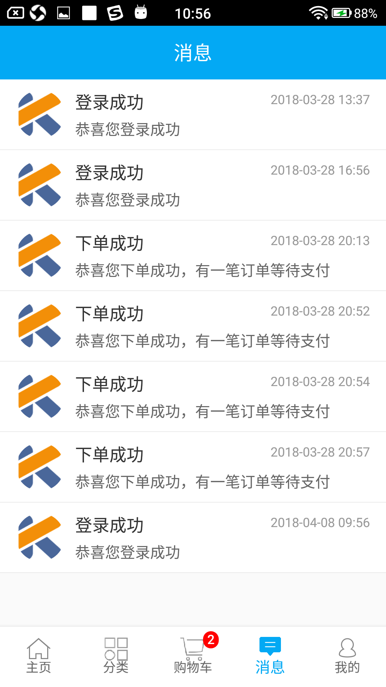

# AFMall
A pure shopping App based on Kotlin + ARouter + MVP + RxJava2 + Retrofit + Dagger2 + 七牛云 + Glide

#### Preview

 

 

 

 

#### Points

+ The entire project is written in kotlin
+ Inter-module communication (page jump and service management) using the ARouter framework
+ Developed using MVP architecture pattern (Presenter is directly implemented, so there is no contract class Contract)
+ Use kotlin framework Kotlin-Android-Extensions, Anko
+ Inject the P layer into the V layer using the annotation artifact Dagger2, without using new, directly using the object
+ Business data processing using Rxjava
+ Use RxLifecycle to manage the lifecycle of Rxjava subscriptions to prevent OOM
+ Communication between components using Rxbus
+ Use Glide for image processing and loading
+ Use the Retrofit web request framework
+ Use okhttp3 to configure the log, request content type (json), header information
+ Use seven cattle cloud to achieve image storage
+ Use BGA-refreshlayout to achieve pull-up refresh, pull-down loading
+ Use Aurora to push Jpush to do message push service

+ 整个项目采用kotlin语言编写
+ 使用ARouter框架进行模块间通信(页面的跳转以及服务管理)
+ 使用MVP架构模式开发(Presenter直接是实现方法的,所以没有契约类Contract)
+ 使用kotlin框架Kotlin-Android-Extensions、Anko
+ 使用注解神器Dagger2,将P层注入V层,无需new,直接用对象
+ 使用Rxjava进行业务数据处理
+ 使用RxLifecycle对Rxjava订阅的生命周期进行管理,防止OOM
+ 使用Rxbus进行组件间的通信
+ 使用Glide做图片处理和加载
+ 使用Retrofit网络请求框架
+ 使用okhttp3对日志、请求内容类型(json)、头部信息进行配置
+ 使用七牛云实现图片储存
+ 使用BGA-refreshlayout实现上拉刷新、下拉加载
+ 使用极光推送Jpush做消息推送服务

#### Version

##### V1.0.0

Initial implementation of the first edition
初步实现第一版

